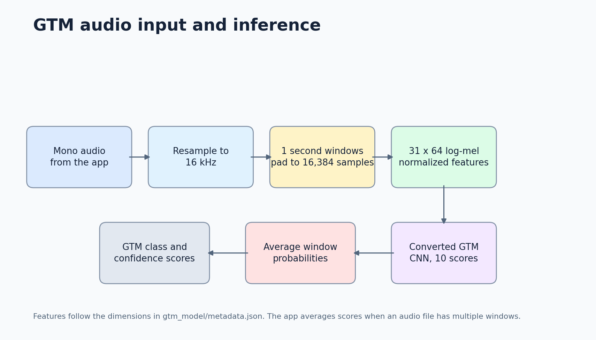
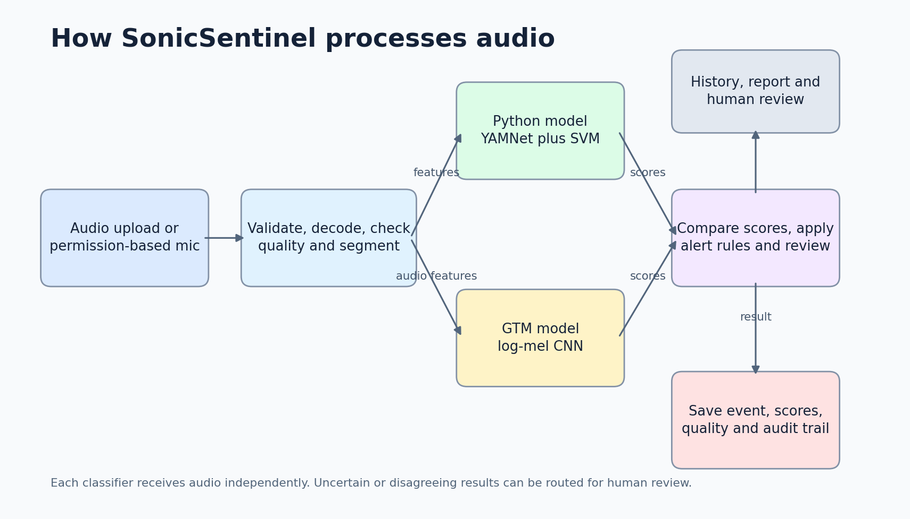

# GTM model integration

The application now runs the supplied Google Teachable Machine export as a second classifier. Python and GTM each receive the audio features they need and return separate scores. The Python result is never used as an input to GTM.

## Files and conversion

`gtm_model/model.json`, `gtm_model/group1-shard1of1.bin` and `gtm_model/metadata.json` are the original TensorFlow.js export and its metadata. The checked-in conversion script reads those files, rebuilds the network, copies its weights and writes `gtm_model/model.keras` and `gtm_model/labels.json`.

```powershell
python scripts/convert_gtm_tfjs.py
python -m pytest -q
python scripts/verify_delivery.py
```

The app requires TensorFlow, which is already part of `requirements.txt`. Both classifiers are warmed before the Flask server accepts requests. This adds startup time, but avoids loading either network during a user's first upload.

## Audio input

The exported network expects a tensor with shape `31 x 64 x 1`. Metadata specifies 16 kHz audio, one-second windows padded from 16,000 to 16,384 samples, a 1,024 sample STFT frame, a 512 sample step and 64 mel bands between 20 Hz and 8 kHz. Each window is normalized separately by subtracting its mean and dividing by its standard deviation. For longer recordings, the application averages window probability scores and normalizes the result.

The supplied class list uses `person_asking_help`. The application uses `person_asking_for_help`; the adapter maps this label while retaining the model's output order.

## Validation and known limits

The converter checks the export format, every weight shape, and unused or truncated shard bytes. Automated tests check the model input shape, finite features, score totals and all ten output labels. The end-to-end script uploads one existing test recording per class through Flask and confirms that both scores are saved, then checks playback, warm performance and dashboard behavior.

The current smoke set produced 8 correct GTM labels out of 10 and 9 correct Python labels out of 10. These are selected examples from the existing project test split, not a new independent study. They do not establish SRS accuracy, macro-F1 or critical-class recall. The required comparison still needs at least 100 genuinely unseen recordings with ten or more examples per class.

The metadata records the mel dimensions and normalization but does not include the original preprocessing source code or a per-file evaluation report. The adapter follows the exported feature contract as described in metadata. A direct numerical parity check against the original Teachable Machine runtime and the training evidence should be added when those materials are available.




