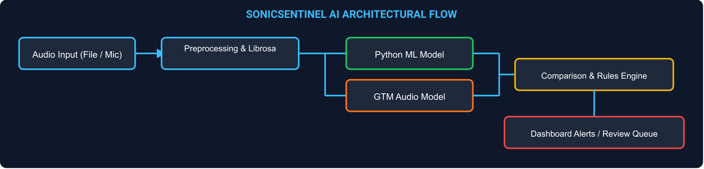

# SonicSentinel AI Technical Blog

*Building a sound monitoring prototype with two audio classifiers and a human review workflow*

## Why we built a sound monitoring application

A camera can show what happened within its field of view, but an unusual sound may come from another room, behind equipment or outside the frame. A breaking window, a change in machinery noise or a call for help can give an operator a reason to investigate. Listening continuously is tiring, especially when useful sounds are mixed with traffic, conversation or factory noise. The business problem behind SonicSentinel AI is to make these recordings easier to review and to draw attention to events that may need action.

Volume alone does not explain what a sound means. A dropped object can be loud without indicating danger, while a quiet call for help can matter. Our project therefore combines audio classification with quality checks, confidence scores and configurable event rules. The aim is to give a user enough information to make a sensible decision, rather than present every loud sound as an emergency.

SonicSentinel AI is a Flask web application with two input modes: uploaded recordings and permission-based microphone monitoring. It covers machinery fault, glass breaking, alarm or siren, vehicle horn, animal sound, gunshot, panic scream, aggression, person asking for help and background noise. Users can listen to a recording, inspect its waveform and spectrogram, review the prediction and look back through event history.

The working application now runs two independent classifiers. The Python model uses a frozen YAMNet audio network and a trained SVM classifier. The supplied GTM export is a separate convolutional network that reads normalized log-mel features. Both receive audio independently and return their own class scores. In a smoke check using one selected existing test recording from each class, Python matched 9 of 10 labels and GTM matched 8 of 10. These examples confirm that the integration runs, but they are not a large or independent accuracy study. The application remains a competition prototype, not a certified emergency-response system.

## How the parts fit together

The browser handles forms, audio playback and microphone permission. Flask validates incoming audio and passes it to shared preprocessing and quality checks. The Python branch builds YAMNet features for the SVM, while the GTM branch resamples audio to 16 kHz, creates one-second log-mel windows and sends those windows to its CNN. The app averages GTM window scores, compares the two models, applies alert rules, and stores the result for history and human review. Neither model receives the other model’s prediction as input.

*Figure 1. The current system flow, including both audio classifiers and human review.*

*The processing flow from audio input to stored events and review.*

SQLite stores the application records. The users table holds account and role details, audio_files holds recording metadata and hashes, detections holds segment predictions and review decisions, and audit_log records actions. Each detection includes model version information so a later review can identify which artifact produced it. Foreign keys connect related records, and database indexes support common history and dashboard queries.

The app provides downloadable HTML analysis reports with recording details, scores and visualizations. Administrators can also export CSV records. These are useful for reviewing a result outside the application, but the current report generator does not create native PDF files. Stating the actual output format avoids confusion when another team member follows the installation or demonstration instructions.

## Building a dataset we can account for

The transfer-learning experiment contains 2,999 unique original recordings across the ten required classes. The SRS minimum is 3,000 originals, so the dataset is currently short by one. Splitting a long recording or producing a noisier copy does not create a new original. We also need to verify the per-class minimums before final submission instead of assuming that the total count proves a balanced dataset.

The experiment uses 2,099 original recordings for training, 450 for validation and 450 for testing. After segmentation and filtering, these produce 2,167 training segments, 477 validation segments and 471 test segments. A source recording stays in one partition with all of its derived segments. Source hashes are checked across the partitions to reduce the risk of an identical recording appearing in both training and testing.

This separation protects the meaning of the evaluation. If a model sees one part of a recording during training and another part during testing, it may recognize the recording conditions instead of learning a useful sound category. Exact hashes help with identical files, but they do not prove that every re-encoded or slightly trimmed copy has been found. Source records and careful duplicate review are still necessary.

Ethical sourcing needs evidence attached to the dataset. Each recording should have a source, permission or licence record, class label and stable Audio ID. Where available, metadata should describe the device, environment and source distance. We should not claim that every recording is licensed or consented merely because it is present in a folder. The submission needs a completed provenance check, especially for speech and any recordings made around other people.

The classical preparation pipeline adds time shifts, noise and volume changes to training audio. These variations can help a model avoid depending on one loudness level or exact event position. They are kept out of the validation and test partitions. The saved YAMNet experiment used original segments without augmentation, so its results should not be described as the outcome of an augmented training run.

## Preparing audio before classification

The application accepts WAV, MP3, FLAC, OGG and M4A uploads. Each file must fit within 25 MiB, last between 0.2 and 30 seconds, and contain mono or stereo audio at a sample rate of at least 8 kHz. M4A decoding uses the FFmpeg executable supplied through imageio-ffmpeg. Invalid or unusable recordings should produce a clear message instead of reaching the model as though they were valid inputs.

Librosa loads usable audio as mono at 22,050 Hz. The pipeline checks that samples are finite and contain a sufficient signal, trims silence and normalizes amplitude. It then creates non-overlapping three-second segments and pads a short final segment with zeros. The YAMNet feature extractor separately resamples its input to 16,000 Hz, which is distinct from the shared preprocessing rate.

One practical failure in the earlier training process was a silent segment stopping feature extraction midway through a run. The preparation and extraction scripts now skip unusable material and log exclusions. Feature extraction also invalidates the previous archive before starting. This prevents a failed run from leaving an old feature file that could be mistaken for the newly prepared dataset.

Quality assessment considers signal strength, clipping and a simple noise measure, then assigns Good, Acceptable, Poor or Unusable status. These checks help the review process, but they are not a complete understanding of the acoustic environment. Normalization and silence trimming are also not the same as removing background noise. The current pipeline should not be described as having solved denoising just because it performs these preprocessing steps.

## Turning sound into useful features

The classical extractor produces a fixed vector of 260 values. It uses statistics from 64 log-mel bands, 20 MFCCs and their first and second derivatives. It also measures spectral centroid, bandwidth, roll-off, flatness, zero-crossing rate and RMS energy. Means and standard deviations summarize how these measurements behave across a segment, allowing recordings of different original lengths to reach the classifier in a consistent form.

The active model adds YAMNet embeddings. YAMNet is a pretrained audio CNN whose weights remain frozen in this experiment. We pool the embedding means and standard deviations and combine them with the mel and MFCC statistics. A standardization step and an RBF SVM then learn the project's ten-class classification task. This is transfer learning with a separate classifier; we did not train a new CNN from scratch on the project dataset.

That distinction also helps explain deployment. The SVM artifact alone is not sufficient, because inference needs the YAMNet base to recreate its input features. The application keeps the classifier, selection file and base model locally. It does not download model weights automatically while processing a user's recording, and the final classification does not come from a generative-AI API.

## Comparing models and reading the results

The classical pipeline supports Random Forest, Extra Trees, Gradient Boosting and scaled SVM candidates. The transfer experiment compares nine classifier candidates built on frozen YAMNet features. Validation macro-F1 selects the winner, and the selected model is then evaluated on the test partition. Scaling is fitted on training data so information from the validation or test recordings does not influence that preprocessing step.

The saved YAMNet and SVM model achieved 86.62% test accuracy and a macro-F1 score of 0.8596 on 471 test segments. These exceed the SRS targets of 85% accuracy and 0.80 macro-F1 for the Python model. The saved earlier SVM report recorded 76.86% test accuracy. The reports show an improvement in the recorded experiments, although they should not be presented as a controlled comparison on an identical newly held-out dataset.

Recall for glass breaking and gunshot was 93.33% each. Panic scream reached 88.89%, aggression 86.67%, and person asking for help 96.97%. These five critical categories meet the specified 85% recall target in the saved benchmark. Background noise was weaker at 62.22%, while alarm or siren and vehicle horn each reached 80%. Looking at those individual classes gives a more useful picture than repeating overall accuracy alone.

The benchmark has already been inspected during development. Its results describe performance on this project split, not a guarantee for new speakers, microphones or locations. Confusion matrices, precision, recall and class-level results remain part of the evidence. A new evaluation should preserve a genuinely untouched set, particularly after changes motivated by errors observed in the current benchmark.

## Giving GTM an independent role

The SRS asks both models to learn from the same underlying training recordings and to generate their own predictions. The intended GTM workflow uses matching class names while keeping validation and test sources separate. Its prediction must come from the audio input, without receiving the Python class or confidence as a shortcut. Agreement is only meaningful when the second result is genuinely independent.

The supplied GTM files are a TensorFlow.js layers-model export. The conversion script maps its weight shard into a Keras model and saves the labels in export order. The input contract in metadata specifies 16 kHz audio, one-second windows padded to 16,384 samples, 31 time frames and 64 mel bands. The adapter normalizes each feature window and averages probabilities across a longer recording. It maps the export label person_asking_help to the application label person_asking_for_help. The metadata does not include the original preprocessing source or a reference score file, so numerical parity with the original Teachable Machine runtime has not yet been demonstrated.

*GTM audio input and inference pipeline.*

When both models are available, the app calculates the absolute difference between their top-class confidence scores. It also compares their predicted labels and checks the Python model's top-two margin. Agreement alone does not automatically make a result acceptable: low confidence, weak separation between classes, unsuitable quality or suspected overlap can still require review. Confidence is an estimated probability from the model, not a certificate that the event occurred.

The current end-to-end smoke check covers ten selected recordings, one per class. It records each model’s scores, label, confidence, agreement and review status in reports/delivery_e2e.json. GTM matched 8 of these 10 labels and Python matched 9. The system also completed a warm 30-second upload in about 2.81 seconds and a three-second live endpoint request in about 0.28 seconds on the local test host. Startup warmed both models in about 27 seconds. These timings describe this computer and test setup, not every deployment.

## Making predictions easier to inspect

Listening to a recording is often the quickest way to understand why a prediction seems unusual. A waveform adds a view of amplitude over time, while a mel spectrogram shows how frequency energy changes. The application generates these images alongside playback so a reviewer can connect the prediction to the recording instead of relying only on a class name.

Waveforms and mel spectrograms are generated from each uploaded recording. A sharp waveform peak may suggest a sudden event, but it does not identify whether the source was breaking glass, a door impact or something else. These visuals support review and explanation; they do not replace classification or human judgment.

## Deciding when an event needs attention

The default rules use a minimum Python confidence of 65%, a top-two margin of 0.12 and Good or Acceptable quality. Suspected overlap prevents an eligible critical detection. Two consecutive eligible detections are required, and critical alerts also require agreement between the models. An uncertain window resets confirmation, which helps stop unrelated or unstable predictions from being counted as a continuing event.

Gunshot, panic scream and person asking for help have Critical severity. Machinery fault, glass breaking, alarm or siren and aggression have High severity. Vehicle horn and animal sound have Low severity, while background noise is Informational. These category labels describe the rule configuration, not proof of an emergency. Recommended actions ask the appropriate person to inspect or respond under local procedures.

Both models now produce independent outputs that feed the agreement and critical-alert rules. The end-to-end smoke check confirms that the application stores both score sets, but one recording per class cannot show how reliably a critical alert works in real use. Automated rule tests use controlled predictions to check the alert logic. They do not establish model accuracy.

## Monitoring through the browser

Live monitoring begins only after the user presses Start monitoring and grants microphone permission. The browser collects samples through the Web Audio API, builds WAV windows and posts them over HTTP about every three seconds. It does not use WebSocket streaming. Results and status messages are updated on the microphone page, and the user can open an event for fuller analysis.

The Stop control releases the microphone, and leaving the page also stops its tracks. If processing falls behind capture, the page reports that a window was skipped rather than building an unlimited queue. Real browser permission denial, device disconnection and long monitoring sessions still need physical-device testing. A successful request to the live endpoint is useful evidence, but it is not a substitute for checking the microphone itself.

## What testing revealed

On 29 September 2026, the regression suite completed with 38 tests passing. Coverage included training checks, upload and reporting flows, access restrictions and alert logic. Real-model route checks processed recordings from all ten classes. One aggression sample was predicted as panic scream, showing that the successful completion of a request does not necessarily mean the classification was correct.

On the tested host, a warm 30-second upload took 2.814 seconds and a warm three-second live request took 0.282 seconds. Both were within the SRS limits of eight and three seconds respectively. The application warmed both models in 26.950 seconds before accepting requests. These local measurements do not guarantee the same performance on different hardware or under concurrent load.

A dashboard check with 20,000 synthetic records completed successfully. That supports the storage-scale check, but it does not establish multi-user capacity or 99% uptime. The saved model and its backup archive also passed their SHA-256 checks. Together, these checks give us a reproducible starting point for delivery without claiming that every operating condition has been tested.

Noise robustness remains a clear weakness. In a small probe, the model correctly classified four of ten noisy samples at 20 dB SNR and one of ten at 10 dB. Those twenty predictions are too few for a broad performance claim, but they are enough to show that noise needs further work. Training and validation augmentation, device diversity and a separate untouched noise evaluation are sensible next steps.

False positives and false negatives need separate attention. A false critical alert wastes an operator's time, while a missed critical event may prevent a useful warning. Similar sounds, quiet speech and overlapping events should therefore be part of the next evaluation. We cannot claim that fireworks, backfires or laughter errors were fixed without recorded tests demonstrating that change.

## Protecting accounts and recordings

The app uses Werkzeug password hashing, signed Flask sessions and CSRF protection for state-changing requests. Public registration creates ordinary users, and trusted roles are provisioned locally. Ordinary users are restricted to their own recordings, while review, acknowledgement and administration actions have role checks. File hashes support duplicate detection, and audit records make important actions traceable.

Microphone status is visible, recordings should be gathered with permission, and runtime storage needs controlled access. Administrators can configure retention and explicitly confirm cleanup. HTTPS must be configured for a deployed service; it is not automatically supplied by the local Flask server. These controls are practical safeguards, but they do not justify an unsupported claim of complete legal or privacy compliance.

## Lessons and the next stage

The main lesson from this work is that the classifier is only one part of a usable audio system. Dataset separation, honest handling of missing results, clear error messages and review tools all affect whether users can trust what they see. A model can meet an average accuracy target while still struggling with background noise or confusing two important categories.

Our next priorities are to compare both models on at least 100 genuinely unseen recordings, confirm the GTM feature calculations against the original Teachable Machine runtime, add the missing original recording, and verify sourcing and per-class counts. We also need physical microphone checks, concurrent-user testing and the remaining submission evidence. Team members should review the implementation and complete their own contribution and AI-usage records rather than treating generated documentation as proof of understanding.

Longer-term ideas include more varied training audio, additional categories, edge deployment and multi-microphone location estimation. Each would need its own measurements and testing. For now, the useful outcome is a working Python-based prototype with traceable results and clearly identified limits, together with a practical route toward the complete system described in the SRS.

## Project evidence

The implementation and measured results are recorded in reports/cnn_training_results.md, reports/delivery_e2e.json, reports/delivery_readiness.md, python_models/yamnet_transfer_metrics.json and the automated tests. Local setup is described in documentation/INSTALLATION.md. The GTM input contract and limits are described in documentation/GTM_MODEL.md. The system and model diagrams in this blog were generated from the current application flow and GTM metadata.
