# SonicSentinel AI Project Documentation

AcousticX Intelligence

NextWave AI and ML

Project report and operating guide

29 September 2026

SonicSentinel AI helps users review sound events from uploaded recordings and live microphone input. It combines two independent audio classifiers with quality checks, configurable alert rules, and a human review workflow.

The active Python model achieved 86.62% accuracy on 471 test segments. The supplied GTM export is integrated and working, but its ten-recording smoke test is too small to establish the SRS accuracy target. This report describes the implemented system, explains the results, and records the work still needed for full acceptance.

The application is a tested prototype. It should support an operator's judgment and should not be treated as a reliable substitute for a safety or emergency response system.

### Document basis

Requirements reference: SonicSentinel AI Software Requirements Specification, Version 1.0, Aptech Limited, 45 pages.

Implementation reference: the local project and saved evaluation artifacts reviewed on 29 September 2026. Automated regression verification completed with 38 tests passing. Historical measurements retain their original test scope and are not presented as fresh field trials.

---PAGE---
## Report guide

The report follows the system from the problem it addresses to its operation and delivery requirements. Results are reported at the level at which they were measured. A source recording, a prepared segment, and an augmented training example are different units and are not counted interchangeably.

| Part | Contents |
| Project and requirements | Purpose, scope, sound classes, functional requirements and quality targets |
| System design | Architecture, modules, data flow, use cases, activity, sequence and decision diagrams |
| Audio and data | Validation, preprocessing, features, source splits and augmentation |
| Model development | Classical models, YAMNet transfer learning and GTM export integration |
| Results | Accuracy, class metrics, confusion matrices, false predictions, confidence and noise analysis |
| Storage and controls | Database relationships, data dictionary, alert rules, security and privacy |
| Verification and operation | Tests, timing, installation, user guide and troubleshooting |
| Delivery assessment | Limitations, better data collection, folder structure and SRS traceability |

### Reading the evidence

The main Python benchmark uses 450 held-out source recordings that produced 471 segments. Some recordings produce more than one segment, so those segments are not independent samples. Accuracy is the fraction of correctly classified segments. Macro-F1 gives every class equal weight, while weighted F1 reflects class support.

The dual-model smoke test uses one existing test recording from each of the ten classes. Its purpose is to check real inference and application integration. It does not satisfy the SRS requirement for at least 100 genuinely unseen recordings with at least ten from each class.

The documentation includes design diagrams, not screenshots of completed browser tests. Generated figures, source values and the report builder are stored under documentation/assets/final_report/. The original draft is preserved there as original_draft.docx.

### Terms

GTM means Google Teachable Machine. In implementation sections, “GTM export” refers to the supplied TensorFlow.js model and its converted local artifact. Its original training project and exact preprocessing parity still need supporting evidence. SNR is signal-to-noise ratio in decibels. A confidence score is a model output, not a guarantee that a prediction is correct.

---PAGE---
## 1 Project purpose and scope

### Background and problem

Important sounds can be missed when staff must listen continuously or search long recordings after an incident. Machinery faults, breaking glass, alarms, screams and calls for help may require attention, while horns, animals and ordinary background sound provide context. A useful monitoring tool must identify these sounds without turning every uncertain prediction into an urgent alert.

SonicSentinel AI addresses this problem with a web application that accepts audio, checks its quality, runs two classifiers, and stores both predictions. It then applies rules to decide whether to record the event, flag it for review, or generate a visible alert. Reviewers can listen to the recording and correct the result without erasing the original model outputs.

### Proposed solution

The Python branch uses a pretrained audio CNN as a feature extractor and a trained support vector classifier for the ten project categories. A separate GTM export predicts from its own log-mel input. The application compares the two results and their confidence scores. Agreement adds useful evidence, but it does not prove that both models are correct.

The system supports uploaded audio, batch processing, live requests, playback, metadata, waveform and spectrogram views, history filters, reports, reviewer actions and administrative rules. It stores events locally in SQLite and keeps uploaded audio in protected application storage.

### Scope and assumptions

The application assumes that an event is represented in the ten training categories and that the recording contains enough usable sound. Help detection is limited to the speech patterns represented in training. It is not a general speech transcription or emergency-language understanding service. Possible overlap is estimated from class scores; the system does not separate mixed sound sources.

The local Windows environment is the verified execution environment. Browser microphone use requires permission and a secure context such as localhost or HTTPS. Model artifacts and writable storage must be available before the application starts. A local execution guide is provided as the SRS fallback where public deployment is unavailable.

### Constraints

The current dataset contains 2,999 unique source recordings, one below the SRS minimum. Synthetic material and uneven recording conditions limit how confidently the results can be applied to real settings. The original source and license history needs stronger documentation. Large datasets and the YAMNet base model are not fully distributed through Git. Physical microphone tests, concurrency, uptime and the required unseen dual-model study remain open.

---PAGE---
## 2 Sound categories and user roles

| Category | Default severity | Intended response |
| Machinery fault | High | Notify maintenance and inspect equipment |
| Glass breaking | High | Notify security and inspect the area |
| Alarm or siren | High | Investigate the alarm source |
| Vehicle horn | Low | Record a traffic or environmental event |
| Animal sound | Low | Record a context-dependent event |
| Gunshot | Critical | Escalate under the local safety protocol |
| Panic scream | Critical | Escalate under the local safety protocol |
| Aggression | High | Ask a security operator to review |
| Person asking for help | Critical | Escalate under the local safety protocol |
| Background noise | Informational | Record environmental context |

Seven categories are marked eligible for confirmed alerts in the default rule file, including the four High categories. Severity and alert eligibility are separate settings. A High or Critical class prediction does not by itself generate an alert. Confidence, quality, agreement and repeated detection still apply.

The SRS severity list includes Medium, while its class-specific descriptions also refer to High. The implementation uses High in its defaults. This naming difference should be agreed with the evaluator rather than hidden in the report.

| Role | Main access |
| Normal user | Register, manage profile, upload, monitor and view own records |
| Reviewer | Listen to queued audio, confirm or correct labels and add comments |
| Security operator | Review events and record alert actions |
| Maintenance operator | Inspect event records and record alert actions |
| Administrator | Configure rules, export CSV, run retention cleanup and access review functions |

Public registration always creates a normal user. Trusted roles are created through the command-line account setup. Ordinary users are restricted to their own audio records; privileged access is enforced by route permissions. The role design helps divide work, but the application does not automatically contact police, emergency services or maintenance staff.

---PAGE---
## 3 Functional requirements

The SRS describes an end-to-end monitoring workflow. The following groups connect those requirements to the implementation. “Implemented” refers to the available application behavior, not proof that every field condition has passed acceptance testing.

| Requirement group | Implementation and remaining scope |
| Accounts and roles | Registration, login, profile updates, unique user IDs and five role values. Privileged roles use trusted provisioning. |
| Audio input | Single and batch upload, common audio formats, browser microphone requests and recording playback. Physical device and permission behavior still needs manual testing. |
| Validation and quality | File checks, decoding, duration and channel limits, silence rejection, clipping and basic noise heuristics. Quality labels are not calibrated measurements of recording intelligibility. |
| Processing and features | Resampling, mono conversion, trimming, normalization, segmentation and padding. Explicit noise reduction and chroma features are not present in the selected pipeline. |
| Classification | Ten-class Python scores and independent GTM export scores, top predictions and saved model versions. GTM training provenance remains incomplete. |
| Comparison and decisions | Label agreement, confidence difference, top-two margin, quality checks, uncertainty, possible overlap and repeated-event rules. |
| Human actions | Review queue, playback, correction, comments, alert actions and audit history. Original model outputs remain available after review. |
| History and reports | Dashboard summaries, chronological events, filters, HTML analysis reports with plots and administrator CSV export. A native PDF export is not implemented. |
| Administration | Configurable rule thresholds and category actions, retention settings and confirmed cleanup. Sustained operational anomaly monitoring is not established. |

### Important behavior boundaries

The current classifiers return one main class for each segment. A low score, small margin, poor quality or disagreement routes the result for review. This provides an uncertainty workflow, but it is not a trained open-set detector that can reliably identify every unseen sound.

A report can display both models' scores even when one model is much less certain. The default threshold is checked against the selected primary model. Uploads normally use Python; live requests prefer GTM when available. This difference must be considered when comparing live and uploaded results.

The SRS calls for broad analytics, including false positives and false negatives. Those measures require reliable truth labels. Aggregate application counts cannot be interpreted as error rates unless the underlying events have been independently labeled or reviewed.

---PAGE---
## 4 Quality targets and acceptance basis

| SRS target | Evidence | Assessment |
| Each model accuracy at least 85% | Python 86.62% on 471 segments; GTM 8 correct out of 10 smoke recordings | Python split target met; GTM target unproven |
| Macro-F1 at least 0.80 | Active Python 0.8596 | Met on the current Python split only |
| Five critical recalls at least 85% | Active Python 86.67% to 96.97% | Met on the current split |
| Upload up to 30 seconds within 8 seconds | Warm measured request 2.814 seconds | Met on the measured host |
| Live processing within 3 seconds | Warm three-second endpoint request 0.282 seconds | Endpoint target met; physical capture unverified |
| At least 20,000 records | Dashboard query 0.052 seconds with 20,000 synthetic events | Single-host scale check passed |
| Concurrent use and 99% uptime | No sustained load or availability study | Not established |
| At least 3,000 unique originals | 2,999 after source preparation | Not met |
| At least 100 unseen dual-model recordings | Ten existing test examples used for smoke checks | Not met |

The timing results exclude the initial 26.950-second model warm-up. Startup now warms both models before analysis requests are accepted. These measurements are useful local checks, but they are not guarantees for every computer, hosting service or concurrent workload.

The five recall targets cover gunshot, glass breaking, panic scream, aggression and asking for help. The active model meets them on this test split. The augmented candidate does not, because aggression recall falls to 82.22%.

### Maintainability and reproducibility

Code is divided into audio preprocessing, feature extraction, models, rules, storage and web templates. Training manifests preserve source splits, and saved metrics identify the feature version and prediction rule. The application uses a selection file to locate the active Python model. Reproducing the environment requires the model-specific dependency versions and the separate YAMNet base artifact.

Security, usability and privacy are also acceptance concerns. Automated checks cover several route and input controls. They do not replace accessibility checks, a real browser walkthrough, deployment hardening or an operational privacy review.

---PAGE---
## 5 Architecture and modules

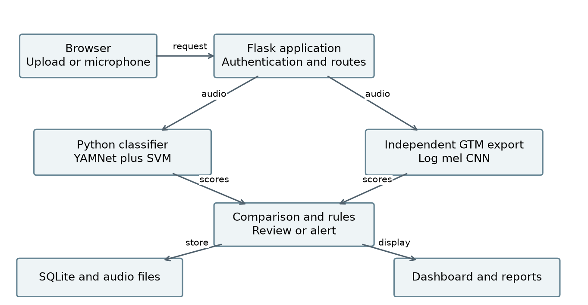

The browser sends uploaded or microphone audio to Flask. The server validates the audio and prepares segments, then runs the Python and GTM branches independently. Their score vectors feed comparison and alert rules. Events and audit actions are stored in SQLite, while audio and generated visualizations are stored as files.

| Module | Responsibility |
| app.py and src/ | Routes, sessions, inference adapters, access control, rules and report integration |
| audio_preprocessing/ | Decoding, validation, signal preparation, quality and fingerprints |
| feature_extraction/ | Handcrafted features, YAMNet embedding and GTM log-mel adapter |
| augmentation/ and scripts/ | Dataset preparation, training variants, training, conversion and verification |
| database/ and config/ | Schema, connections, paths and application constants |
| templates/ and static/ | Server-rendered pages, styling, microphone controls and client interaction |
| python_models/ and gtm_model/ | Saved classifiers, metadata, evaluation outputs and model selection |

The web interface uses Jinja templates and JavaScript. Model inference runs locally; final classification does not call a generative-AI service. File storage and the database need to be backed up together so that a stored event still points to its audio.

---PAGE---
## 6 Data flow and use cases

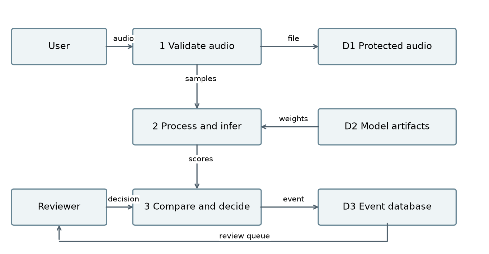

The diagram separates persistent audio, model artifacts and event records. The reviewer contributes a decision after listening to an event. That decision supplements the saved predictions. It does not become a new training example automatically.

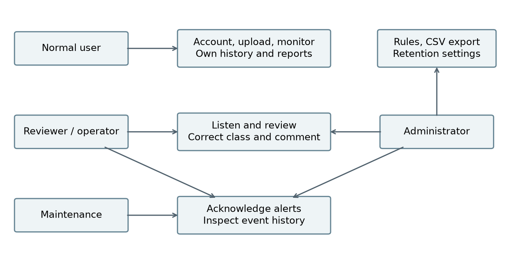

All protected actions require a valid session. The diagram summarizes responsibilities; administrator access includes functions shown for operational roles. Exact permissions are enforced in the application routes rather than by hiding interface buttons alone.

---PAGE---
## 7 Processing activity and request sequence

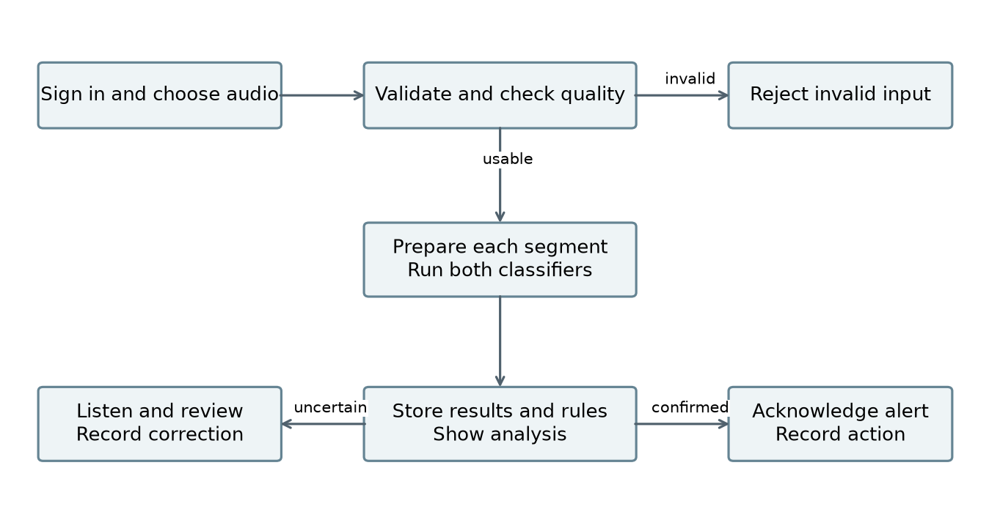

Invalid or unusable recordings stop before inference. Valid recordings may create several segment records. Review and alert actions follow classification and remain attributable to the signed-in user.

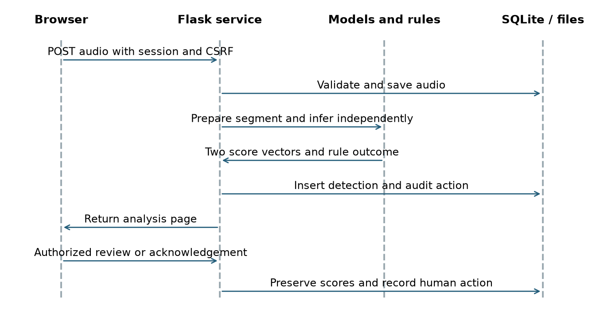

Both model results are collected before the normal comparison outcome is stored. The sequence is a logical request flow, not a claim that the two model calls execute in parallel. The recorded timing includes real model inference in the tested application path.

---PAGE---
## 8 Audio preparation and feature extraction

### Input checks

Supported extensions are WAV, MP3, FLAC, OGG and M4A. The configured per-file limit is 25 MiB. Recordings must last from 0.2 to 30 seconds, have at least an 8 kHz sample rate, and contain one or two channels. Batch upload accepts up to ten files. M4A decoding uses the FFmpeg executable supplied by imageio-ffmpeg before shared validation.

The loader rejects an empty signal, non-finite values and signals whose peak magnitude is below 0.005. It checks the signal again after trimming. Training feature extraction now catches expected unusable-audio errors, writes the file and reason to data/excluded_features.csv, and continues with usable recordings. It removes the old feature archive before extraction and replaces a temporary archive only after completion. This prevents a failed run from silently reusing stale features.

### Python processing

Audio is converted to mono at 22,050 Hz, trimmed at a 35 dB threshold and peak-normalized. Non-overlapping three-second segments are produced; the final segment is padded when necessary. Start and end offsets are stored with detections. Quality checks must refer to the signal before normalization, because normalization can hide an originally weak recording.

The handcrafted feature vector has 260 values. It summarizes 64 log-mel bands, 20 MFCCs, 20 first-order MFCC differences, 20 second-order differences, and six scalar feature series using their means and standard deviations. The scalar series are spectral centroid, bandwidth, roll-off, flatness, zero-crossing rate and RMS energy. The STFT uses a 2,048-sample window and 512-sample hop.

The selected transfer model also resamples the segment for YAMNet at 16 kHz. Means and standard deviations of its 1,024-dimensional frame embeddings provide 2,048 values. Combining these with 260 handcrafted values gives 2,308 inputs to the selected classifier.

### Quality and visualization limits

Quality labels use RMS, clipping fraction and an amplitude-percentile noise heuristic. They are not measured environmental SNR. The application produces waveform and spectrogram images for analysis and reports, with authorized access and cached generation. Chroma extraction and an explicit denoising stage required by the SRS remain gaps. Adding them should be evaluated on validation data rather than assumed to improve accuracy.

---PAGE---
## 9 Dataset and source separation

The saved experiment contains 2,999 unique source recordings across all ten categories. The preparation manifest records each source path, class, hash, duration, rate, channels and split. This is useful for reproduction, but a local filename is not a complete record of who created a sound, how it was collected, or whether it may be redistributed.

{{DATA_TABLE}}

| Partition | Original sources | Prepared original segments |
| Training | 2,099 | 2,167 |
| Validation | 450 | 477 |
| Test | 450 | 471 |

The source split is approximately 70%, 15% and 15%. Segmentation explains why prepared counts are larger than source counts. The asking-for-help class has more test segments because its recordings can span multiple windows. The dataset is short of the SRS minimum by one original; extra segments and augmentation cannot close that gap.

Source hashes are checked before preparing variants. The saved augmented experiment reports no source-hash leakage between splits. Exact hash separation does not rule out recordings derived from the same original event, shared synthetic templates or re-encoded near duplicates. Future splits should also group by recording session, speaker, location and generation source.

The project data includes synthetic material and non-uniform recording conditions, as identified in the project brief. The current metadata does not quantify the synthetic share or provide complete generation provenance. Those limits must remain visible when interpreting benchmark results.

---PAGE---
## 10 Augmentation and training workflow

Augmentation creates controlled variations of training audio. It helps expose a model to conditions beyond a single clean recording, but does not create new independent events. Validation and test audio remain unaugmented so the candidate can be compared on the same saved split.

| Training variant | Prepared examples | Purpose |
| Original segment | 2,167 | Retain the original training signal |
| Time shift up to about 180 ms | 2,167 | Vary event timing |
| Gaussian noise at 20 dB SNR | 2,167 | Add a moderate noise condition |
| Gaussian noise at 10 dB SNR | 2,167 | Add a stronger noise condition |
| Volume scaling from 0.72 to 0.92 | 2,167 | Vary amplitude |
| Total training examples | 10,835 | Five variants per training segment |

The saved augmented experiment has 477 validation segments and 471 test segments. The complete prepared set contains 11,783 examples, including these unchanged evaluation partitions. Random choices use the recorded seed of 7 and source-dependent generation. Manifests and hashes allow variants to be traced back to their source.

### Reproducible development sequence

- Validate originals and document excluded recordings. Resolve missing provenance before distribution.
- Split by source group before segmentation or augmentation. Preserve the split manifest.
- Extract features and fit any scaling on training data only.
- Compare candidates using validation macro-F1. Freeze the selected configuration before testing.
- Evaluate with the same probability-argmax rule used by the application, then save model, metrics and feature version together.

The notebooks cover classical training, transfer training and augmented transfer training. The older silent-recording failure occurred during feature extraction, before a complete feature archive was produced. A successful downstream training command does not prove that the preceding extraction succeeded; the current archive handling and exclusion log address that failure mode.

The augmented model is saved as an experiment. It is not the active deployment model. Equal overall test accuracy is not sufficient reason to replace a model when important class recalls become worse.

---PAGE---
## 11 Python model design and selection

Classical experiments compare Random Forest, Extra Trees, Gradient Boosting and scaled SVM models using handcrafted features. This covers more than the SRS minimum of three model families. The transfer experiment adds pretrained CNN features rather than attempting to train a large CNN from scratch on a small local dataset.

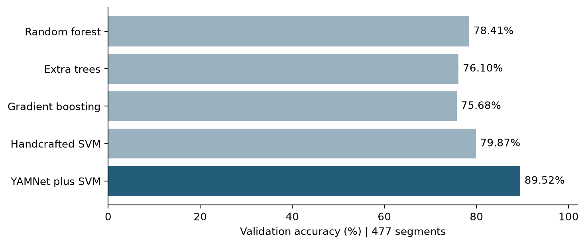

YAMNet is a pretrained MobileNet-based audio CNN. Its weights remain frozen in this project. A separate classifier is trained on project features, so “CNN transfer learning” describes the feature pipeline; it does not mean the CNN was fine-tuned end to end.

Nine transfer candidates compare logistic regression with C values of 0.1, 1 and 10, SVM models using mean embeddings with C values of 1, 10 and 100, and SVM models using combined features with the same three C values. Scaling or normalization is part of the relevant fitted pipeline.

The active selection is svm_combined_c100, using an RBF SVM with C=100, gamma=scale, balanced class weights and probability outputs. The selected feature version is yamnet-mean-std-mfcc-v1. The application chooses the largest stored class probability, which also defines the reported evaluation rule.

Validation accuracy is 89.52% and validation macro-F1 is 0.8891. The best representative handcrafted SVM reached 79.87% validation accuracy and 76.86% test accuracy. The active transfer model improves test accuracy by about 9.77 percentage points on the 471-segment benchmark. Older nine-class reports are not included in this comparison because their label set and test size differ.

---PAGE---
## 12 Python benchmark results

| Metric | Active Python | Augmented candidate |
| Validation accuracy | 89.52% | 89.52% |
| Validation macro-F1 | 0.8891 | 0.8891 |
| Test accuracy | 86.62% | 86.62% |
| Test macro precision | 0.8604 | 0.8616 |
| Test macro recall | 0.8614 | 0.8621 |
| Test macro-F1 | 0.8596 | 0.8606 |
| Test weighted F1 | 0.8648 | 0.8654 |

Both models classify 408 of 471 test segments correctly. Rounded validation scores appear equal, but the active model has a slightly higher saved validation macro-F1. The augmented candidate uses svm_combined_c1. Its small gain in test macro-F1, about 0.0010, should not be treated as evidence of a general improvement.

{{CLASS_TABLE}}

The table gives the active model's test results. Precision measures how often predictions of a class are correct. Recall measures how many actual examples of that class are found. F1 combines the two. Macro scores average class scores equally; they are not the same as the weighted F1 shown above.

The active model exceeds 85% recall for glass breaking, gunshot, panic scream, aggression and asking for help. Background noise is its weakest class at 62.22% recall. This matters because confusing ordinary sound with a critical event can increase review workload or produce false alarms.

These are segment-level results on an already inspected project split. Repeated use of the same benchmark during development reduces its value as a final independent test. A new, source-separated field test is needed before making broader accuracy claims.

---PAGE---
## 13 Confusion matrix and error analysis

Diagonal cells are correct predictions. Off-diagonal cells show which categories were confused. The matrix contains 63 errors in total. Class support is 45 segments for each category except asking for help, which has 66.

An event-class false negative means that a real event of that class was assigned another label. A false positive means that another class was assigned that event label. These classification errors do not map directly to alert errors because quality, agreement and repeated detection can suppress an alert. Alert precision and recall need a separate time-based evaluation against labeled events.

The low background recall and noisy-input behavior suggest a need for more varied negative examples. Reviewers should examine source families, recording conditions and ambiguous labels before adding more copies of the same sounds. The matrix alone cannot establish why an error happened.

---PAGE---
## 14 Class errors and augmentation tradeoffs

{{ERROR_TABLE}}

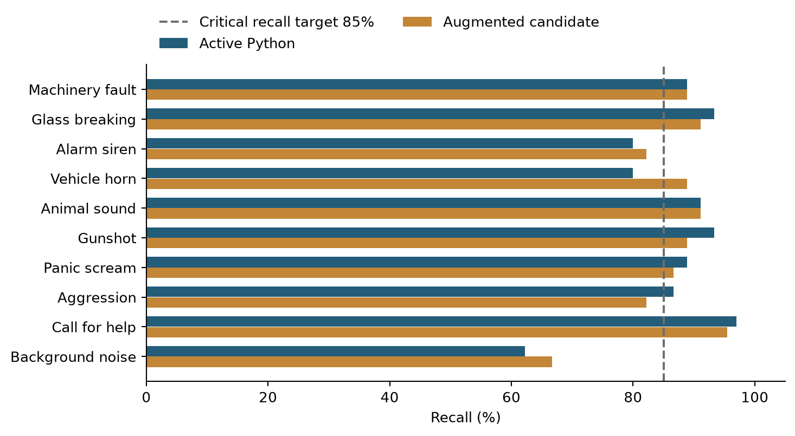

The augmented candidate has aggression recall of 82.22%, below the SRS target of 85%. Its gunshot, glass-breaking, panic-scream and help recalls also decline from the active model, even though overall accuracy stays the same. Some other classes improve enough to offset those losses.

This is a useful lesson from the experiment: more training variants do not automatically make a model better for the project's purpose. Gaussian noise and volume changes may not resemble the conditions that separate difficult classes in real recordings. A separate noise evaluation of the augmented candidate is still needed; the clean benchmark cannot establish noise robustness.

---PAGE---
## 15 Augmented candidate confusion matrix

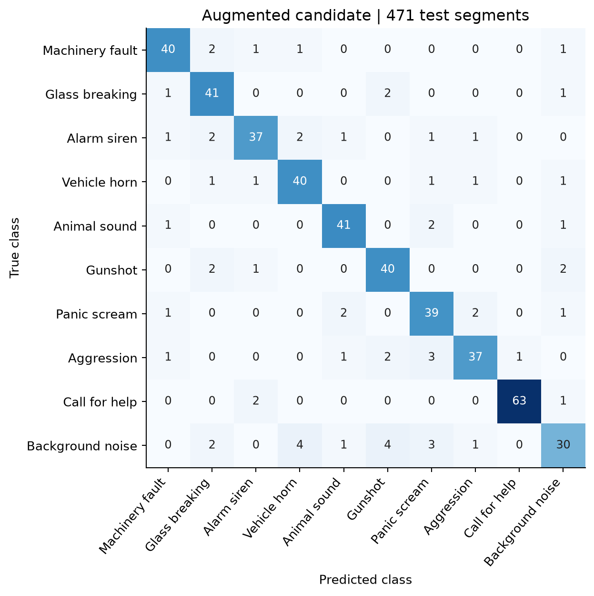

This matrix provides a direct comparison with the active model because both use the same source split and the same final prediction rule. The distribution of mistakes changes even though the total remains 63. The saved candidate remains available for further experiments without changing the active model selection.

Training-set performance and epoch curves are not reported here because the available artifacts do not contain verified learning curves for these experiments. An SVM trained on fixed CNN embeddings also does not have the same epoch history as an end-to-end neural network. The report therefore uses the actual validation and test outputs rather than inventing a training trajectory.

Future experiments should preregister the selection rule on validation data, include critical-class recall as an explicit validation constraint, and reserve a new test set for final acceptance. Choosing repeatedly on test results would overstate expected performance.

---PAGE---
## 16 GTM model design and integration

The supplied GTM model is a TensorFlow.js layers export with model.json, a binary weight shard and metadata.json. A conversion script produces model.keras for local TensorFlow inference. Its CNN has four convolution blocks with 32, 64, 128 and 128 filters, batch normalization, ReLU and pooling, followed by global average pooling, dropout and a ten-class output. The metadata supplies the class order and expected input dimensions. The export label person_asking_help is mapped to the application label person_asking_for_help.

The adapter converts each segment to mono at 16 kHz. It builds one-second inputs, pads to the required analysis length, and uses a 1,024-point STFT with a 512-sample step. Power spectra are mapped to 64 mel bands from 20 to 8,000 Hz, transformed with a log offset, and normalized per example. The resulting input shape is 31 by 64 by 1. The CNN predicts each window, then the adapter averages and normalizes the class scores.

This branch receives audio features, not Python model scores. It is an independent inference path. Its class scores, predicted category and model version are stored separately from the Python outputs.

### Training evidence and reproducibility

The export is integrated, but the original GTM project, training screenshots, class sample counts and exact original preprocessing code still need to accompany the submission. The current metadata guided the adapter; it does not by itself prove exact numerical equivalence with the original training pipeline. The export alone also does not establish that the SRS requirement for training inside Google Teachable Machine has been met.

A complete GTM handoff should record the original project or share link, training settings, all ten class counts, the source split used, validation method, export date and model files. The team should compare reference predictions from the original environment with local predictions on identical audio and resolve any preprocessing mismatch before claiming parity.

### Observed integration result

In the ten-recording smoke test, Python classified nine correctly and the GTM export classified eight correctly. The models agreed on eight labels. GTM confused glass breaking with alarm/siren and aggression with machinery fault. Python confused the aggression example with panic scream. These are integration examples, not a representative test of deployment accuracy.

---PAGE---
## 17 GTM confusion and confidence comparison

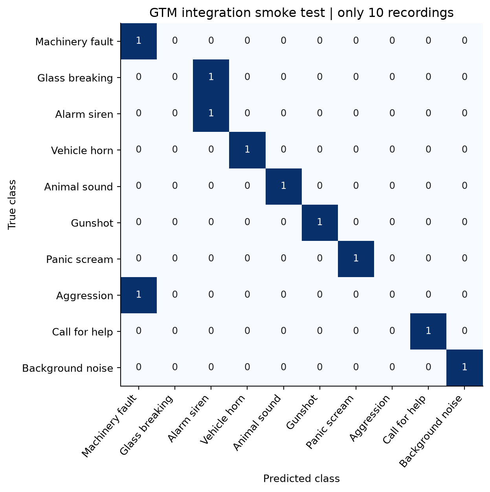

Each true class has just one recording in this matrix. A single error therefore changes the sample accuracy by ten percentage points. It would be misleading to compare this 80% smoke result directly with the Python model's 86.62% score on 471 segments or to claim that GTM already meets the 85% requirement.

The required follow-up is a common unseen set of at least 100 recordings, with at least ten from every class. Both models must receive the same source recordings. Record truth, predicted labels, all scores, confidence difference, margin, quality, severity, review status and correctness. Aggregate accuracy, macro-F1, critical recalls and confusion matrices must be calculated separately for each model.

---PAGE---
## 18 Confidence and noise robustness

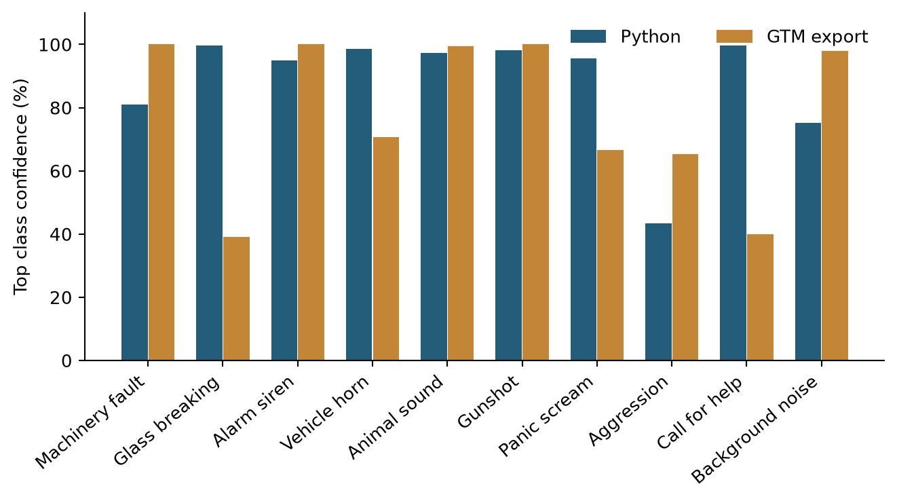

Confidence values are useful for ranking uncertainty within a model, but the Python and GTM scores are not proven to be equally calibrated. A large confidence difference is not a measured difference in real-world reliability. In the help example, GTM is correct at about 39.90% confidence while Python is correct at about 99.74%. The upload decision uses the Python score, so this example is not automatically rejected by a threshold applied to both models.

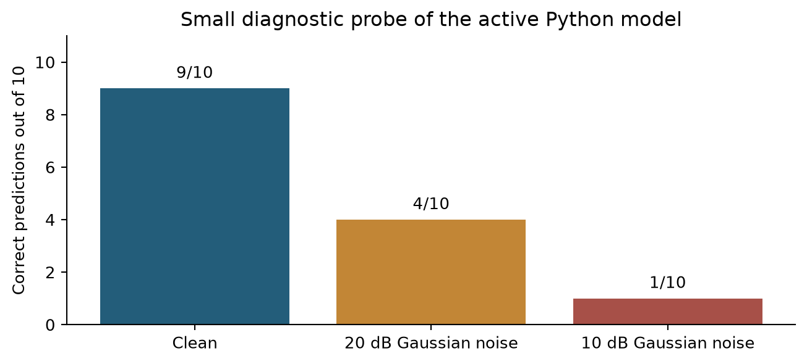

The active model gets nine of the ten clean examples correct, four at 20 dB Gaussian noise, and one at 10 dB. At 10 dB, the probe predicts asking for help for all ten examples. This is a serious diagnostic warning, but the sample is small and artificial Gaussian noise is not a full test of real ambient noise. These figures belong to the active unaugmented model, not the later augmented candidate.

Non-uniform recording conditions and synthetic sound patterns are plausible contributors to the gap between clean and noisy performance. They can encourage the model to learn source-specific textures instead of stable event characteristics. The current tests do not isolate their causal effect, so the report treats this explanation as a supported concern to investigate, not a measured attribution.

---PAGE---
## 19 Alert rules and decision flow

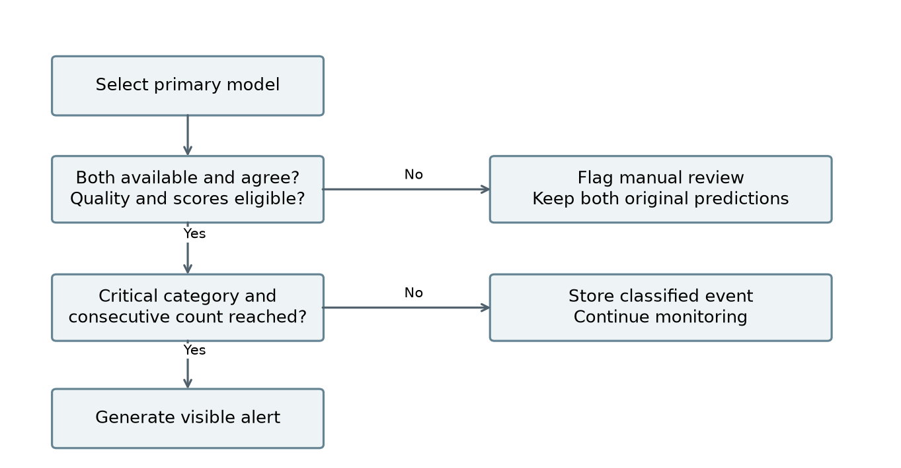

The default minimum confidence is 0.65 and the minimum gap between the top two scores is 0.12. Quality must be Good or Acceptable. Critical alert generation normally requires agreement, no possible overlap and two consecutive eligible windows of the same label. The confirmation interval falls back to 15 seconds when no explicit value is configured.

An uncertain window resets confirmation. A model mismatch, unavailable model, poor quality or weak score causes manual review. Possible overlap and near-duplicate checks can also route records for review. The overlap flag is based on several significant class scores, not verified separation of simultaneous sources.

Uploads use Python as their normal primary model. Live windows prefer GTM when it is available; otherwise the available model is used. Both predictions remain stored. The flow diagram describes the default agreement policy. Administrators can change the critical agreement rule, so an altered configuration must be validated before use.

The temporal counter is kept in process memory and is bounded to 1,000 streams. It is not shared between multiple workers and is lost on restart. A production deployment needs shared, durable confirmation state and explicit handling of capture gaps. The default actions are recommendations displayed to people, not proof that an external response has occurred.

---PAGE---
## 20 Database design

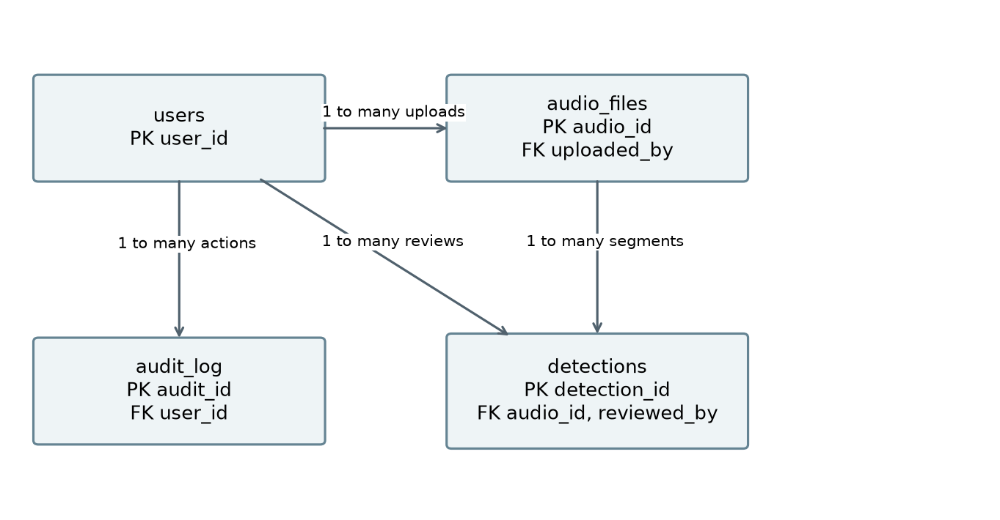

SQLite stores four main entities. A user can upload many audio files. An audio file can create many segment detections. A reviewer can be associated with many reviewed detections, and a user can create many audit entries. Foreign keys are enabled for each connection, and write-ahead logging supports the local access pattern.

The detections table keeps original Python and GTM results alongside final class and human review fields. This allows a reviewer correction without overwriting the model evidence. JSON score maps and quality details are stored as text. Application timestamps use UTC ISO-formatted values.

Indexes support uploader lookup, detection lookup by audio, detection time and audit lookup by user. They help common history and dashboard requests. They do not establish behavior under many simultaneous writers.

The following dictionary groups related fields to keep the schema readable. PK means primary key, FK means foreign key, NN means not null, and UQ means unique. Fields without NN are nullable in the schema. Metadata fields being present does not prove that all existing recordings have complete values.

Audit target_id is descriptive rather than a declared FK, because target_type may identify different tables. Retention and backup procedures must account for both stored files and the records that refer to them.

---PAGE---
## 21 Data dictionary for users and audio

| users fields | Type and constraints | Meaning |
| user_id | INTEGER PK | Unique account identifier |
| username | TEXT NN UQ | Login name |
| email | TEXT NN UQ | Account email |
| password_hash | TEXT NN | Hashed password, never plaintext |
| role | TEXT NN CHECK | user, reviewer, operator, maintenance or admin |
| display_name | TEXT | Profile display name |
| created_at, updated_at | TEXT NN | Account creation and update times |

| audio_files fields | Type and constraints | Meaning |
| audio_id | INTEGER PK | Unique recording identifier |
| uploaded_by | INTEGER FK | References users.user_id |
| filename, stored_path | TEXT NN | Original name and protected stored location |
| sound_category | TEXT | Associated category metadata |
| duration_s | REAL | Recording length in seconds |
| sample_rate, channels | INTEGER | Sampling rate and channel count |
| bit_depth, file_size | INTEGER | Bit depth when known and size in bytes |
| recording_environment | TEXT | Recording context when supplied |
| recording_device | TEXT | Device information when supplied |
| source_distance | TEXT | Source distance description when supplied |
| is_original | INTEGER | Original or derived recording indicator |
| dataset_split | TEXT | Training, validation or test designation |
| file_hash | TEXT UQ | Exact-file duplicate identifier |
| perceptual_hash | TEXT | Simple spectral fingerprint |
| status | TEXT NN | Defaults to Uploaded |
| created_at | TEXT NN | Upload or insertion timestamp |

A file hash protects against exact duplicates. The spectral fingerprint is a heuristic for similarity and can produce false matches or miss re-encoded copies. Neither field replaces source ownership, consent, license or recording-session metadata.

---PAGE---
## 22 Data dictionary for detections and audit

| detections fields | Type and constraints | Meaning |
| detection_id | INTEGER PK | Unique segment result |
| audio_id | INTEGER NN FK | References audio_files.audio_id |
| segment_start, segment_end | REAL | Segment offsets in seconds |
| python_class, gtm_class | TEXT | Independent predicted labels |
| python_scores, gtm_scores | TEXT | JSON maps of class scores |
| python_model_version, gtm_model_version | TEXT | Inference artifact identifiers |
| agreement_status | TEXT | Match, disagreement or uncertainty status |
| confidence_difference | REAL | Absolute difference of top confidences |
| top_two_margin | REAL | Primary model top score minus second score |
| quality, quality_details | TEXT | Quality label and JSON measurements |
| overlap_detected | INTEGER NN | Possible overlap flag, defaults to 0 |
| final_class, severity | TEXT | Rule or reviewed category and severity |
| alert_status | TEXT | Current alert or review status |
| recommended_action | TEXT | Suggested operator response |
| manual_review | INTEGER NN | Review flag, defaults to 0 |
| reviewer_decision, reviewer_comment | TEXT | Human correction and explanation |
| reviewed_by | INTEGER FK | References users.user_id |
| reviewed_at | TEXT | Time of human review |
| created_at | TEXT NN | Detection creation time |

| audit_log fields | Type and constraints | Meaning |
| audit_id | INTEGER PK | Unique audit entry |
| user_id | INTEGER FK | Account responsible for the action |
| action_type | TEXT NN | Recorded action name |
| target_type | TEXT | Entity type affected |
| target_id | INTEGER | Identifier of the affected entity |
| details | TEXT | Additional action context |
| created_at | TEXT NN | Action timestamp |

---PAGE---
## 23 Testing strategy and observed results

The regression suite completed on 29 September 2026 with 38 tests passing in 65.56 seconds. The tests cover important input, permission, rule and workflow behavior. Some tests use mocked model scores to isolate application logic; those tests are not evidence of classifier accuracy.

| Test area | Evidence and scope |
| Accounts and security | Registration roles, access checks, cross-user protection and CSRF behavior |
| Audio handling | Invalid input and silence handling, preprocessing and feature consistency |
| Decisions and review | Agreement, confidence, repeated windows, review actions and report workflows |
| GTM adapter | Real preprocessing and inference checks, alongside isolated logic tests |
| Real upload integration | Ten existing test recordings processed through Flask; both model results stored, analysis and playback checked |
| Local performance | Warm 30-second upload 2.814 s; warm live request 0.282 s; 20,000-row dashboard 0.052 s |
| Model artifact checks | Earlier delivery verification matched the saved Python snapshot checksums |

The recorded delivery integration measurements are from the saved 28 September verification evidence. The 29 September regression run updates the test count; it does not make every historical browser or performance measurement a new test.

### Remaining acceptance tests

Use at least 100 genuinely unseen recordings for a common dual-model study. Include at least ten per class, challenging negative sounds and a separately reported overlap set. Record per-class precision, recall and F1, as well as alert false positives, missed events and time to alert. Keep model selection independent of this final set.

Perform a real browser and microphone walkthrough covering permission denial, disconnect, pause, restart, sustained capture, playback controls, mobile layout and critical event confirmation. Endpoint latency does not include all microphone buffering or physical device behavior.

Run concurrent upload and monitoring sessions with realistic audio, measure tail latency and memory, and verify isolation across users. Test retention and recovery using disposable data. A 20,000-row query benchmark is not a concurrency or uptime test. Availability needs a deployed service and a measured observation period.

---PAGE---
## 24 Security and privacy

Passwords are stored as hashes using Werkzeug utilities. Sessions identify the signed-in account, POST actions use CSRF protection, and role checks limit privileged routes. Ordinary users cannot read another user's audio through an authorized application route. Upload validation rejects unsuitable formats, sizes and signal properties before normal analysis.

Audio playback and generated report images use protected application routes. CSV export is restricted to administrators and protects cells that might otherwise be interpreted as spreadsheet formulas. Review and operational actions are recorded in the audit log. Retention cleanup requires confirmation because it removes stored data.

### Audio privacy

Speech and environmental audio may contain personal information even when the intended label is only “background noise.” Collect recordings with permission, keep the capture area clear of unrelated people, and explain the purpose and retention period. Do not use private conversations as convenient negative samples. Minimize the audio collected and keep identifying details out of filenames and published figures.

The default retention setting is 90 days. The appropriate duration depends on the deployment context and must be agreed before operation. Access to backups, exported CSV files and the raw upload directory needs the same care as access through the application.

### Deployment controls still required

Use HTTPS outside localhost, protect session secrets, restrict filesystem access, configure backups and test restoration. Keep model artifacts from trusted sources because loading a serialized Python model can execute code. Separate production data from training experiments and development accounts.

The repository does not establish encryption at rest, a completed penetration test, external alert delivery, or a formal operational privacy process. These should not be inferred from the presence of login and CSRF controls. Public submission materials must exclude runtime databases, passwords, session secrets and unlicensed or confidential recordings.

AI assistance is declared in AI_USAGE.md. The project team still needs to record its actual review, modifications and verification. Git co-author trailers alone do not prove that each member reviewed or understands every module.

---PAGE---
## 25 Installation and model handoff

The locally verified training environment used Python 3.13.9, TensorFlow 2.20.0, scikit-learn 1.7.2, NumPy 2.3.5 and joblib 1.5.2 on Windows. Use requirements-trained-model.txt when running the saved model. Other platforms need their own installation and audio checks.

Run the following commands from the project root in PowerShell:

> python -m venv .venv
> .\.venv\Scripts\python.exe -m pip install -r requirements-trained-model.txt
> .\.venv\Scripts\python.exe -m flask --app app create-user --role admin
> .\.venv\Scripts\python.exe app.py

The account command prompts for the username, email and password. Change the role option to create trusted reviewer, operator or maintenance accounts. Share evaluator credentials privately. Open http://127.0.0.1:5000 after startup. If the port is occupied, set SONIC_PORT to another local port before launching.

### Required model artifacts

Keep python_models/yamnet_transfer.joblib, python_models/selection.json and the entire python_models/yamnet_base/ directory together. The YAMNet base is Git-ignored. The local deliverables/model_snapshot_20260927/trained_model.zip and its sha256.json provide the saved Python handoff. Confirm checksums when moving the artifact to another machine.

Keep the GTM export, metadata, class labels and converted model.keras under gtm_model/. The conversion script is scripts/convert_gtm_tfjs.py. Converting weights does not resolve missing training provenance or preprocessing parity evidence.

### Storage and verification

Default writable locations are data/sonic_sentinel.db, uploads/ and instance/. Environment variables SONIC_DATABASE_PATH, SONIC_UPLOAD_DIR, SONIC_RUNTIME_DIR and SONIC_RULES_PATH can override the storage and rule paths. Back up persistent storage before changing these settings.

> .\.venv\Scripts\python.exe -m pytest -q
> .\.venv\Scripts\python.exe scripts/verify_delivery.py

The delivery script needs both models and the original local paths recorded in data/transfer_experiment/manifest.json. A clone alone may not contain the required audio or base model. It writes integration results to reports/delivery_e2e.json and uses isolated runtime storage for its checks.

---PAGE---
## 26 User guide and troubleshooting

### Normal analysis

Register or sign in, choose an audio file and submit it for analysis. The upload screen shows progress while processing. Open the result to listen to the recording, inspect metadata and compare the waveform and spectrogram with the predicted event. Check both model outputs, their leading scores, the quality label and the final rule decision.

Use history filters to find recordings by audio ID, filename, category, date, confidence, severity, quality, review status or user where permitted. History is paginated at 100 records per page and the review queue at 25. Open a detection to download its HTML report. Administrators can export CSV for further analysis.

### Live monitoring and review

Open microphone monitoring on localhost or HTTPS and allow browser access. Start monitoring, observe the model and alert status, and stop recording when finished. If access is denied or the device is unavailable, correct the browser or operating-system permission before retrying. A displayed prediction is not evidence that an external emergency response was sent.

A reviewer or operator can listen to a queued event, confirm or correct the label, and add a comment explaining the decision. Authorized operational roles can record alert actions. Original class scores remain available for later inspection. Administrators can adjust thresholds and category actions, but new settings should be tested on labeled validation cases.

| Problem | Action |
| Silent or unusable recording | Inspect the audio and exclusion log. Replace the source or improve capture level; do not force a class label. |
| M4A decoding fails | Confirm imageio-ffmpeg is installed and the file is valid. Try a permitted WAV copy for diagnosis. |
| Model unavailable | Restore the selected classifier, matching YAMNet base and complete GTM files. Check startup output. |
| First startup is slow | Allow both models to warm up. Do not compare cold startup with warm inference timing. |
| Both models disagree | Listen to the event and review quality and competing classes. Preserve the disagreement in the review record. |
| Live and upload labels differ | Consider the different primary model and windowing paths. Compare the saved scores before changing thresholds. |
| Reports or plots fail | Check writable storage, file permissions and the original audio path. Reproduce in isolated test storage. |

---PAGE---
## 27 Limitations and better data collection

The strongest result is the active Python model's 86.62% accuracy on the saved project split. The weakest evidence is generalization to noise, unfamiliar sources and real microphone conditions. These limits are consistent with a dataset that contains synthetic material and non-uniform recordings. Different gain levels, durations, sample rates, devices, rooms and generation patterns can become shortcuts for a classifier.

Synthetic examples can help cover rare sounds, but many examples generated from the same pattern may add little new information. A model can learn that pattern and still fail on a real event. The source manifests do not quantify the synthetic proportion or establish all recording relationships, so the size of this effect is not measured. Class balance alone does not guarantee acoustic diversity.

### A stronger collection plan

Collect consented recordings across several devices, rooms, distances and background conditions. For machinery, record normal and faulty operation from the same equipment with technician-confirmed labels. For alarms, horns and glass-like sounds, include similar non-target events so the model learns the distinction. Use licensed archival recordings or controlled, safe simulations for dangerous events rather than staging harmful incidents.

For help and aggression classes, involve multiple consenting speakers, accents and speaking styles. Label the acoustic behavior represented in the recording rather than assuming a person's intent. Include ordinary conversation, laughter, television and other hard negatives. Keep private and unrelated speech out of the dataset.

Record source owner, license, consent status, device, environment, distance, event time, speaker or session group, synthetic status and generation method. Ask two reviewers to label difficult clips and resolve disagreements. Keep an untouched collection from different sessions and locations for acceptance testing.

### Modeling improvements to evaluate

Use real background recordings and measured room responses for training augmentation, then compare against the existing Gaussian-noise baseline. Consider fine-tuning a compact audio CNN with careful regularization once more diverse data is available. Evaluate a temporal model for events that need context, and a multilabel model if overlapping events become a core requirement.

Calibrate probabilities on validation data and test an explicit unknown-event detector. Choose thresholds using validation recall and false-alarm costs, then freeze them for the final test. Report class-level results and source-group uncertainty, not only overall accuracy. Each proposal is future work and has not been demonstrated to improve this project yet.

---PAGE---
## 28 Project structure and distribution

All directory names requested in SRS section 1.10 are present. The required root files README.md, AI_USAGE.md, requirements.txt and LICENSE are also present. Additional folders support scripts, dataset manifests, archives and local runtime state. Keeping useful extra folders does not conflict with the required structure.

| Required folder | Purpose and delivery note |
| src/ | Application support modules |
| templates/ and static/ | Web pages, scripts and styling |
| data/ | Feature and experiment metadata; exclude private runtime data |
| audio_dataset/ | Local source audio and prepared partitions; separately distribute permitted data |
| notebooks/ | Classical, transfer and augmented training notebooks |
| python_models/ | Classifiers, selection and metrics; supply base model archive separately |
| gtm_model/ | TensorFlow.js export, metadata and converted local model |
| feature_extraction/ | Handcrafted, transfer and GTM input preparation |
| audio_preprocessing/ | Validation and audio preparation |
| augmentation/ | Training data transformations |
| alert_rules/ | Default configurable decision rules |
| database/ | SQLite schema and connection helpers |
| tests/ | Automated regression suite |
| sample_audio/ | Reserved for licensed evaluator samples; README explains the pending content |
| documentation/ | Final report, installation notes, model notes and technical blog |
| screenshots/ | Reserved for verified application captures; README explains the pending content |
| reports/ | Saved training and delivery evaluation evidence |
| config/ | Paths, constants and settings |

The structure audit is saved as documentation/assets/final_report/structure_audit.json. The sample_audio and screenshots folders now contain guidance files so the required directories persist in version control. Folder presence does not mean their required submission content is complete.

The final report is documentation/documentation.docx. The original documentation filename also contains the finalized report, while its rough version is preserved with the report assets. Generated plots are supplied as PNG and SVG, with CSV values and the source builder. QA renders are kept separately under tmp/ and are not submission evidence.

---PAGE---
## 29 SRS traceability and remaining work

| SRS reference | Coverage in this report | Status or next action |
| 1.1 to 1.5 background, purpose, scope and constraints | Sections 1 to 4 | Documented with current limitations |
| 1.6 accounts, upload, preview and metadata | Sections 2, 3, 8 and 26 | Implemented; finish physical browser acceptance |
| 1.6 preprocessing and acoustic features | Sections 8 to 10 | Noise reduction and chroma remain open |
| 1.6 common dataset and metadata | Sections 9, 10 and 27 | Add legitimate originals and complete provenance |
| 1.6 Python training and tuning | Sections 11 to 15 | Multiple families evaluated; active selection documented |
| 1.6 GTM training and independent inference | Sections 16 to 18 | Inference integrated; original training and parity evidence pending |
| 1.6 comparison, uncertainty and critical rules | Sections 18 and 19 | Implemented rules; validate unseen event and alert behavior |
| 1.6 review, history and reports | Sections 20 to 26 | Core workflow implemented; full analytics scope needs acceptance review |
| 1.7 performance and reliability | Sections 4 and 23 | Local warm timing passes; concurrency and uptime unproven |
| 1.8 integrity and common evaluation | Sections 9, 17, 24 and 27 | Complete genuine GTM evidence and 100-recording unseen comparison |
| 1.9 hardware and software interfaces | Sections 5, 8 and 25 | Windows local workflow documented; other hosts unverified |
| 1.10 project report and diagrams | Sections 1 to 30 | Report, dictionary and required diagram types supplied |
| 1.10 source structure | Section 28 and structure audit | Required paths present; some media and data content pending |
| 1.10 submission media and deployment | Sections 25 and 28 | Local guide available; video, screenshots and evaluator samples pending |

### Acceptance order

First complete lawful source documentation and the minimum original count. Then freeze a common unseen evaluation set and verify the GTM input pipeline against the original training environment. Evaluate both models and the alert behavior, including noisy and overlapping events. Finally complete the physical microphone walkthrough, load checks, screenshots and demonstration video.

The technical blog is a separate artifact and must independently meet the SRS length and content requirements. Public repository availability, team contribution evidence, evaluator access and any deployment URL also need final submission checks. This report does not certify those items merely because their expected locations are listed.

---PAGE---
## 30 Evidence register and references

The numerical plots are generated from saved project evaluation artifacts. They do not use mock predictions or illustrative accuracy values. Model files were not retrained or changed as part of this documentation update.

| Evidence | What it supports |
| SRS Version 1.0, Aptech Limited | Required scope, quality targets, report contents and submission structure; especially sections 1.6 to 1.10 |
| python_models/yamnet_transfer_metrics.json | Active validation and test metrics, confusion matrix, split counts and environment |
| python_models/yamnet_augmented_metrics.json | Augmented candidate metrics and training example counts |
| python_models/selection.json | Active Python model, candidate and feature version |
| python_models/*_metrics.json | Classical validation comparison; only matching benchmark records are used |
| reports/transfer_validation_results.json | Transfer candidate validation results |
| reports/delivery_e2e.json | Ten-recording integration outputs, noise probe and local timing |
| reports/delivery_readiness.md | Earlier delivery checks and remaining acceptance gates |
| audio_dataset/yamnet_augmented/ | Source and prepared manifests, source counts and leakage summary |
| database/db.py | Actual table fields, constraints and indexes |
| audio_preprocessing/ and feature_extraction/ | Actual preprocessing and model input definitions |
| src/models.py, src/rules.py and alert_rules/default.json | Inference selection and decision behavior |
| documentation/INSTALLATION.md and GTM_MODEL.md | Local handoff and GTM integration details |
| 29 September regression run | python -m pytest -q --tb=short; 38 passed in 65.56 seconds |

### External model reference

The pretrained base is Google YAMNet, identified by the saved experiment as https://tfhub.dev/google/yamnet/1. TensorFlow's official guide, Sound classification with YAMNet, describes its MobileNet architecture and 16 kHz mono input: https://www.tensorflow.org/hub/tutorials/yamnet (accessed 29 September 2026). Its pretrained weights support feature extraction; the project-specific SVM supplies the ten-class decision. The local model archive and dependency versions should accompany reproduction of the reported experiment.

### Report maintenance

After new data, model selection or rule changes, rerun the relevant evaluation and rebuild the plots from the resulting metrics. Keep the old experiment outputs so improvements and regressions can be compared honestly. Update this report's date, sample sizes and acceptance status together. A new overall accuracy score should never replace the class and noise analysis without checking the underlying evidence.
